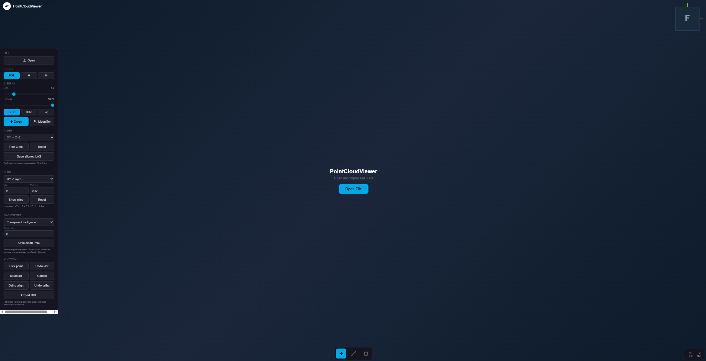

```markdown
# A2 PointCloud Draft



A lightweight single-file HTML tool for working with `.las` point clouds: alignment, slicing, first-person scan walking, tracing, measuring, PNG export and DXF export.

The main goal is simple: turn a point cloud into a clean CAD-ready reference without ReCap, Revit or heavy desktop software.

## Video demo

[Watch the video on YouTube](https://youtu.be/o1aOV6jLIGU)

## Features

* Open and view uncompressed `.las` point clouds
* 3D navigation, perspective view and top orthographic view
* First-person walking mode inside the point cloud
* Walk through scans using `W A S D`
* Rotate walking view with `Q / E`
* Adjust walking camera pitch with `R / F`, reset with `0`
* Pick alignment points while inside the scan
* Align point clouds by selected planes
* Create slices by `XY`, `XZ` or `YZ` planes
* Manual point picking on a slice
* Draw open or closed contours
* Measure segment lengths
* Orthogonalize traced contours
* Export traced linework to `DXF`
* Export clean `PNG` slice images
* Export `PNG + DXF` raster reference for CAD
* PNG export with white or transparent background
* Scale bar for CAD image scaling
* Crosshair and magnifier for accurate manual tracing
* Save aligned LAS after plane alignment

## Supported format

Currently supported:

```text
.las — uncompressed LAS point clouds
```

Not supported yet:

```text
.laz
.ply
.pcd
.xyz
.txt
```

If you have a `.laz` file, convert it to uncompressed `.las` first.

## Interface overview

### File

Open a `.las` point cloud file.

Large point clouds may be opened as a preview. Slice operations can still use the full LAS source when available.

### Display

Controls for point cloud visualization:

* point size;
* opacity;
* perspective view;
* orthographic view;
* top view;
* crosshair;
* magnifier.

### First-person walk mode

The bottom toolbar includes a first-person walking mode for moving through the scan like a game location.

Controls:

```text
W / A / S / D        move forward / left / backward / right
Shift               faster movement
Q / E               rotate view around vertical Z axis
R / PageUp          look up
F / PageDown        look down
0                   reset view pitch to horizontal
```

Mouse navigation is disabled in walking mode so the mouse remains available for picking points, measurements and drawing tools.

This is useful when the required alignment points are inside a room or hidden from a top/side view. You can walk into the scan and use `Pick 3 pts` directly from the current first-person position.

### Align

Align the point cloud using three picked points on a plane.

Available alignment modes:

```text
XY → Z = 0
XZ → Y = 0
YZ → X = 0
```

Typical floor alignment workflow:

1. Enable walk mode if the floor points are inside the scan.
2. Walk to the required location.
3. Select `XY`.
4. Click `Pick 3 pts`.
5. Pick three points on the floor.
6. The cloud is aligned horizontally.

After that, another alignment can be applied using a wall plane to rotate the plan into building axes.

### Slice

Create a point cloud slice by selected plane.

Example:

```text
Plane: XY
Start: 1.20
Width: 0.30
```

This shows a horizontal slice:

```text
Z = 1.20 ... 1.50 m
```

This is useful for creating floor-plan references from point clouds.

### Drawing

Manual tracing tools for the active slice:

* pick points;
* undo last point;
* close a contour;
* measure segments;
* orthogonalize contours;
* export traced lines to DXF.

Picked drawing points are placed on the current slice plane. This makes it possible to manually reconstruct corners even if the point cloud itself has rounded or noisy corner geometry.

### PNG export

Export a clean PNG image from the current cloud or slice.

PNG export can create:

* white background;
* transparent background;
* red point cloud rendering;
* scale bar below the image;
* image without UI panels or dark viewer background.

This is useful for inserting a point cloud slice into CAD as a reference image.

### PNG in DXF export

`Save PNG in DXF` exports two files:

```text
a2_...png
a2_...dxf
```

The DXF contains a CAD raster image reference to the exported PNG and scales it in millimeters.

Example:

```text
70 m scale bar in PNG = 70000 DXF units
```

Important: the PNG file must stay next to the DXF file, because standard DXF raster images are stored as external image references, not embedded bitmap data.

This mode is intended for comparing a point cloud slice with an existing CAD drawing.

### Drawing DXF export

The Drawing panel also exports manually traced linework to DXF.

This is a different task from `PNG in DXF`:

* `Drawing DXF` exports traced CAD lines.
* `PNG in DXF` exports a raster point cloud reference image for comparison.

## Typical workflows

### CAD raster reference workflow

1. Open a `.las` file.
2. Align the point cloud by the floor.
3. Align the plan by a wall or main building axis.
4. Create the required slice.
5. Export `Save PNG in DXF`.
6. Open the DXF in CAD with the PNG located in the same folder.
7. Compare the raster point cloud reference with an existing drawing.

### Manual tracing workflow

1. Open a `.las` file.
2. Align the point cloud.
3. Create a slice at the required height.
4. Trace walls, columns or other contours.
5. Run `Ortho align`.
6. Export traced linework to `DXF`.

## Limitations

* This is not a replacement for Revit, AutoCAD or professional Scan-to-BIM software.
* The tool is intended for quick point cloud interpretation and CAD reference preparation.
* Large point clouds may be opened as preview.
* Full aligned LAS export from a browser can be limited by browser storage restrictions.
* Raster DXF export references an external PNG file; the PNG is not embedded into the DXF.
* For heavy point cloud processing, a desktop/native version is a better approach.

## Use cases

* Floor-plan tracing from point clouds
* Building survey workflows
* Walking through indoor scans to pick alignment points
* Quick CAD raster reference generation
* Manual wall and column tracing
* Point cloud slice export to PNG
* PNG raster reference export to DXF
* Simple DXF linework generation
* Checking geometry after laser scanning

## How to run

Download the HTML file and open it in a browser.

Recommended browsers:

```text
Google Chrome
Microsoft Edge
```

## Repository contents

```text
PointCloudViewer.html   Main single-file application
screen.PNG              Program screenshot
README.md               Project description
```

## Author

A2 Engineering / A2 Blog

Telegram: https://t.me/a2blog
```
